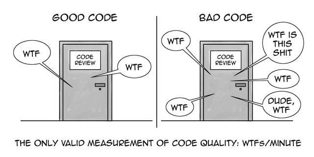
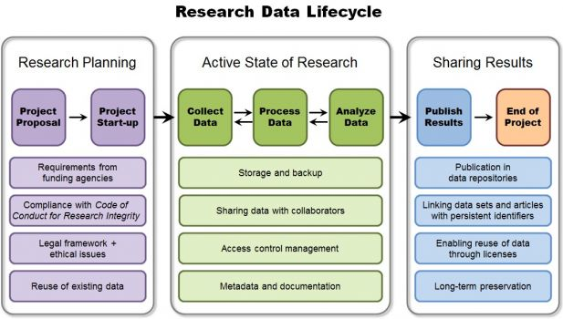
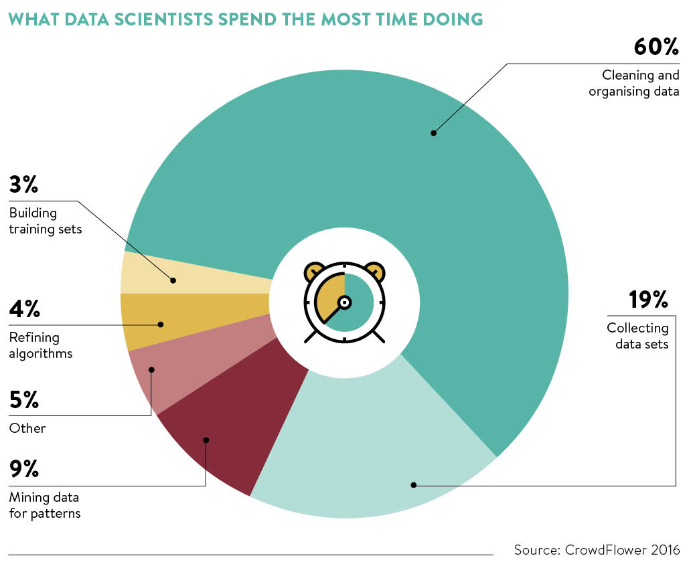
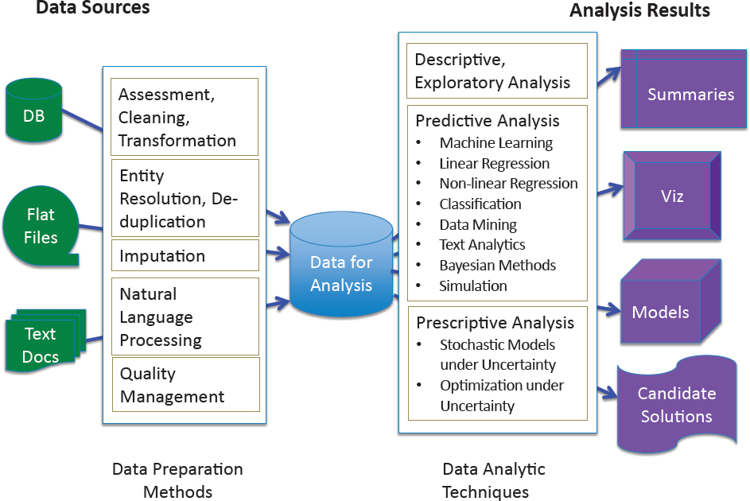
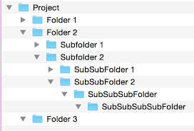

```{r setup, include=FALSE}
options(htmltools.dir.version = FALSE)
```


# Overview

In today's talk, I will introduce data management and reproducible research. 

<br>
Given I'm an 
```{r, echo=FALSE, out.width='10%', fig.cap=''}
knitr::include_graphics('./images/RLadiesLogo.png')
```
Perth cofounder, there will be bias towards R. However, the concepts presented are applicable to any programming/statistical software used in your research. 

<br>
Today I will address the following questions:

--

- What is data management?

--

- What is reproducible research?

--

- How can you make your research more reproducible?

--

- What is RMarkdown and why should you learn how to use it?

---

class: inverse, center, middle

# What is data management?

```{r, echo=FALSE, out.width='70%', fig.align='center', fig.cap=''}

```


---

## What is data management?

Data management is a set of principles and practices that ensure high quality through the complete lifecycle of your data. 

Effective data management means better, leaner, cleaner data leading to better analytics and in our case, reproducible research.

```{r, echo=FALSE, out.width='60%', fig.align='center', fig.cap=''}

```


---

class: inverse, center, middle

# What is reproducible research?

```{r, echo=FALSE, out.width='75%', fig.align='center', fig.cap=''}
knitr::include_graphics('https://bluesyemre.files.wordpress.com/2013/02/381743_10151184159063429_372225777_n.jpg?w=600')
```


---

## Introduction

In the current scientific climate, a sound knowledge of computational tools is becoming increasingly important. These tools are used to manage and analyse data, as well as present research findings. 

However, the presentation of results is not limited to generating tables and figures that are exported and inserted into a document. You can generate reports which contain all your data cleaning/processing notes, code used at each step, and your research outputs using the R Programming Language. These reports can be made as Word, PDF or HTML formats, to name a few. 

```{r, echo=FALSE, out.width='75%', fig.align='center', fig.cap=''}
knitr::include_graphics('http://phdcomics.com/comics/archive/phd031214s.gif')
```


---

## What is reproducible research?

<br/>

### Reproducibility is not the same thing as replication!! 

<br/>

**Replication:** same conclusions drawn in a new study.

<br/>

**Reproducibility:** same results from same data and code.

--

<br/>

>Although replication is the gold standard, it isn't always feasible (i.e. if the study is too big, too costly, too time consuming, rare samples, or once off event). Thus, reproducibility may be used as a minimum standard of validity. 

---

## What is reproducible research?


Reproducible research can be considered a minimum standard in the sciences. It becomes particularly important when juggling multiple studies. 

The logic here is two-fold:

--

<br/>

* **Provide evidence of the correctness of your results.**

> Adopting a reproducible workflow means providing our audience with the code and data that demonstrates the decisions we made as we generated our results. This makes it easier for others to satisfy themselves that our results are reliable (or not, since reproducibility is no guarantee of correctness).

--

<br/>

* **Enable other researchers to use our models and results.**

> Equipped with only our published article, our colleagues might struggle to reconstruct our method in enough detail to apply it to their own data. Adopting a reproducible workflow means publishing our code and data in order to allow our colleagues to extend our approach to new applications with a minimum of effort. This has the potential to save a great deal of time in transmitting knowledge to future researchers.


---

## Why is reproducible research important?

Although these may be obvious, the following support why reproducible research concepts should always be implemented.

--

* It is, and has always been, an essential part of science; not doing so is simply bad science.

--

<br/>

* It is an important step in the Scientific Method allowing science to progress by building on previous work; without it progress slows.

--

<br/>

* It requires the submission of the data and computational tools used to generate the results; without it results cannot be verified and built upon.

--

<br/>

* It is necessary to prevent scientific misconduct; the increasing number of cases is causing a crisis of confidence in science.

---

## The 5 levels of computational reproducibility 

**Reviewable Research -** the descriptions of the research methods can be independently assessed and the results judged credible, including through both traditional peer review and community review. Importantly, it does not necessarily imply reproducibility.

--

**Replicable Research -** tools are made available that would allow a researcher to duplicate the results, for example by running the code to produce the plots shown in the publication. Here tools might be limited in scope.

--

**Confirmable Research -** the main conclusions of the research can be attained independently without the use of software provided by the author. Therefore, the results are confirmed by following the authors' instructions. 

--

**Auditable Research -** sufficient records (including data and software) have been archived so that the research can be defended later if necessary or differences between independent confirmations resolved. The archive might be private, as with traditional laboratory notebooks. 

> This is the case at ECU.

--

**Open or Reproducible Research -** auditable research made openly available. This comprised well-documented and fully open code and data that are publicly available that would allow one to (a) fully audit the computational procedure, (b) replicate and also independently reproduce the results of the research, and (c) extend the results or apply the method to new problems. This is limited in the health/medical sciences due to ethical considerations. 

---

## Also, documentation doesn't begin with data analysis, silly... 

Importantly, documentation should not only be kept for analyses performed and figures generated, but it is vital to have a complete record of all data cleaning/processing steps and exploratory analyses too (the latter where you may make decisions on what models to fit). 

```{r, echo=FALSE, out.width='50%', fig.align='center', fig.cap=''}

```

---

class: inverse, center, middle

# How can you make your research more reproducible?


```{r, echo=FALSE, out.width='70%', fig.align='center', fig.cap=''}
knitr::include_graphics('https://i.pinimg.com/originals/4f/60/ac/4f60ac52a58e10e5ad8b421e0e174ceb.png')
```

---

## First things first...

```{r, echo=FALSE, out.width='70%', fig.align='center', fig.cap=''}

```

---

## Have a good filing system in place

You should have set 'working environments' for your analyses. At a minimum, I would include a data processing folder, cleaned data folder, folder containing any articles/scripts used as reference for your analyses, and your analyses folder with the necessary subfolders for different studies (for example).

<br/>

```{r, echo=FALSE, out.width='40%', fig.align='center', fig.cap=''}

```

---

## The folder commandments

**Use folders and subfolders -** group files within folders so information on a particular topic is located in one place

--

**Adhere to existing procedures -** check for established approaches in your team or department which you can adopt

--

**Name folders appropriately -** name folders after the areas of work to which they relate and not after individual researchers or students. This avoids confusion in shared workspaces if a member of staff leaves, and makes the file system easier to navigate for new people joining the workspace

--

**Be consistent -** when developing a naming scheme for your folders it is important that once you have decided on a method, you stick to it. If you can, try to agree on a naming scheme from the outset of your research project

--

**Structure folders hierarchically -** start with a limited number of folders for the broader topics, and then create more specific folders within these

--

**Separate data processing and final data -** it is a good idea to have a separate folder with all your final and cleaned datasets, separate from your working folders

--

**Backup -** ensure that your files, whether they are on your local drive, or on a network drive, are backed up

--

**Review records -** assess materials regularly or at the end of a project to ensure files are not kept needlessly. 

---

## Let's talk about data structure, baby!

Data structure refers to the way data is organised, manipulated and stored. It seeks to find ways to make data access more efficient. 

<br/>

When dealing with data structure, we not only focus on one piece of data, but rather different sets of data and how they can relate to one another in an organised manner. Good data structure is the foundation of all analyses. 

<br/>

```{r, echo=FALSE, out.width='50%', fig.align='center', fig.cap=''}
knitr::include_graphics('./images/DataStructureInfographic.png')
```

---

## Data structure

From experience, I have seen that early involvement in data collection is crucial to reducing data cleaning/processing time at the completion of a collection, as well as ensuring you collect the right data.

```{r, echo=FALSE, out.width='80%', fig.align='center', fig.cap=''}
knitr::include_graphics('./images/What-data-scientists-hate-doing-the-most.jpg')
```

--

### Efficient data cleaning = less time wasted fixing small issues = one big smile on your dial! :) 

---

## Things to consider when preparing data

There are many things to consider when you are preparing your dataset for not only analysis but storage, since (in theory) it should be easy for someone to pick up where you left off. 

* Is it in the right format (i.e. did you convert numbers stored as text strings into numeric values, format dates, etc)? 

* Is it consistent and comparable?

* Are there spelling mistakes in the variables or the values?

* Do you have missing data? Have you considered imputation?

* Are you certain the data you are cleaning was collected correctly?

* Were your actions to clean the data justified or have you maybe gone too far (**beware!!**)?

* Is what you did in the data cleaning steps repeatable? 

* Did you get rid of redundant blank spaces?

* Did you remove duplicates?

* Have you changed text to lower/upper/proper case consistently?

* Etc... 

---

## Store the data in a suitable and efficient format

Once collected, you should store your data in a suitable, stable and efficient format. 

<br/>

Spreadsheets are good for data entry. Therefore, we generally store a lot of data in spreadsheets. Popular options include `.csv` or `.txt` formats, since they are easily readable into many different programming/statistical packages.

<br/>

> Well that's cool, but `.csv` and `.txt` formats don't allow for value coding like `.sav`, `.dta` or other similar formats... 

<br/>

**No worries!** You can get around this by either having separate sheets/files for the value coding (if complex) or simply adding this to your code while you're loading the data into your 'working environment'. 

---

## Suitable documentation

At a very minimum, you should have at least detailed written notes that allow for the complete reproduction of your work.

<br/>

Optimally, you will have an automated script that runs your analyses from start to finish. 

<br/>

#### RMarkdown and knitr, packages within the R Programming Language, give you the flexibility of storing all your data cleaning, labelling, exploratory analyses and final analyses/outputs in the same document, with executable code. 

---

## Keeping a record of your 'working environment'

Although using a version control protocol is preferred (i.e. you can set up GitHub to link with RStudio in a current R Project... not for today)...

```{r, echo=FALSE, out.width='30%', fig.align='center', fig.cap=''}
knitr::include_graphics('http://phdcomics.com/comics/archive/phd101212s.gif')
```

---

## Keeping a record of your 'working environment'

At a minimum, you can record the `sessionInfo()`, which takes a snapshot of all the packages and package versions within the current working environment. Cool, huh?

```{r}
sessionInfo()
```

---

class: inverse, center, middle

# What is RMarkdown and why should you learn how to use it?

```{r, echo=FALSE, out.width='25%', fig.align='center', fig.cap=''}
knitr::include_graphics('./images/rmarkdown.png')
```

---

## What is this wizardry?!

A suite of packages in R, known as the `tidyverse`, contains particular functions for reading, processing, manipulating, calculating, plotting, and reporting your analyses. You can even 'pipe' between the individual `tidyverse` packages so they flow between functions (neat, right?!).

<br/>

```{r, echo=FALSE, out.width='80%', fig.align='center', fig.cap=''}
knitr::include_graphics('./images/tidyverse.png')
```

---

## What is this wizardry?!

The rest of this presentation assumes some knowledge in R. If you are a beginner, however, there will be clickable links to useful resources along the way. 

<br/>

Check out [https://tidyverse.org] for access to the **R for Data Science** eBook (an excellent first reference) as well as working through RStudio workshops, including [https://rmarkdown.rstudio.com] and [https://bookdown.org/yihui/bookdown/] for more on RMarkdown functions.

<br/>

Before you begin, make sure you have R and RStudio downloaded on your computer. These are easily searchable through the 
```{r, echo=FALSE, out.width='10%'}
knitr::include_graphics('https://www.google.com/logos/doodles/2015/googles-new-logo-5078286822539264.3-hp2x.gif')
```
search engine. Download the latest version for your computers capacity. 

---

## What is RMarkdown?

R Markdown documents are **fully reproducible**. You code into the `RMarkdown` document using RStudio, then use `knitr` to weave the narrative text, code chunks and outputs together to produce elegantly formatted reports (in Word, PDF, HTML, and it even has formats to produce these slides!!!).

```{r, echo=FALSE, out.width='30%', fig.align='center'}
knitr::include_graphics('http://applied-r.com/wp-content/uploads/2019/01/rmarkdown_workflow.png')
```

---

## Why not use normal scripting??

Simple answer is, you can. However, writing in the console or a basic script can be error prone. 

<br/>

RMarkdown files are fully executable so you can be sure there are no mistakes once the file is weaved together (it even sends error messages to let you know where issues are within the document). 

<br/>

```{r, echo=FALSE, out.width='80%', fig.align='center', fig.cap=''}
knitr::include_graphics('./images/RMarkdownFlow.png')
```

---

## It is almost practise time, but here's a quick run down first

```{r, eval=FALSE}
install.packages("tidyverse") # run this line once per computer
library(tidyverse) # run this line everytime you want to use any of the tidyverse packages


#NOTE: text can be left in code chunks by using a hash symbol from the point of code you want "blanked out""
```

<br/>

### Two options are available for inputting code

* Code chunks (as shown above)

* Inline code

---

## Code chunks have many options

* `include = FALSE` - code runs and results be used by other chunks, but doesn't appear in finished file

* `echo = FALSE` - prevents code, but not the results from appearing in the finished file (useful way to embed figures)

* `eval = FALSE` - prevents code chuck from being evaluated (useful way to show but not run code)

* `message = FALSE` - messages do not appear in the finished file

* `warning = FALSE` - warnings do not appear in the finished file

* `fig.cap = "..."` - adds a caption to graphical results

<br/>

See this [**RMarkdown Cheatsheet**](https://rstudio.com/wp-content/uploads/2015/03/rmarkdown-reference.pdf) for further options. 

See the [**Definitive RMarkdown Guide**](https://bookdown.org/yihui/rmarkdown/) for more options.

---

## Inline Code

Code results can be inserted directly into the text of a .Rmd file by enclosing the code with 
```{r, eval=FALSE}
`r` #you get these side flicks just under the ESC button
```

---

## Correct "SOP" for starting an RMarkdown document

* Set up your folder directory in a sensible location and include relevant subdirectories (i.e. common subdirectories are `data`, `images`, `results`, etc...)

--

* Open RStudio

--

* Click on `File` -> `New Project` -> `Existing Directory` and find your newly created RMarkdown directory

--

* Open a new RMarkdown document, via `File` -> `New File` -> `RMarkdown`. Name it however you like and select `HTML` for now. 


---

## Adding images

Add images to text chuck using:

``

A caption can go within the [ ]. It is best to store these images within a separate `image` subdirectory in the .Rmd file directory (i.e. where you set up the RProject).

You can also use this format in a code chunk:
```{r, out.width='50%', fig.align='center', echo=TRUE}
knitr::include_graphics('./images/RLadiesLogo.png')
```

--
**FUN FACT: you can insert hyperlinks into your document using `[](webaddress.com)`. **

---

## You can create simple tables

All that is required is inputting the below into the normal code, not the code chunks themselves. 

```{r, echo=TRUE, eval=FALSE}
Table Header | Second Header
------------- | -------------
Table Cell | Cell 2
Cell 3 | Cell 4 
```

Table Header | Second Header
------------- | -------------
Table Cell | Cell 2
Cell 3 | Cell 4 

<br/>

> Other options for tables are available but check online for full options

---

## Debugging tip before we begin

* **Line number in error message -** note that this will refer to the beginning of the code chunk, hence shorter code chunks make debugging easier, as well as make them clearly visible in your document. 

<br/>

```{r, echo=FALSE, out.width='30%', fig.align='center'}
knitr::include_graphics('https://cdn2.iconfinder.com/data/icons/color-svg-vector-icons-2/512/error_warning_alert_attention-512.png')
```


---

## References

**Below are some reference materials you may use to further your learning journey. **

<br/>

* A workshop I gave earlier in the year summarising a lot of the learning resources in R: [https://youtu.be/GWbgDYRaPr8]

* A website deployment introducing reproducible research: [http://ropensci.github.io/reproducibility-guide/]

* Another workshop, this time extending into version control: [http://kbroman.org/steps2rr/]

* A summary of the different output types you can generate in RMarkdown: [https://mdozmorov.github.io/BIOS567.2017/presentations/01a_Markdown/01e_Presentation.pdf]

* Another workshop on reproducible research, with links to examples of the different outputs available: [http://applied-r.com/project-reporting-template/]

* Remember, many R-users deploy their code online, which makes learning new code easier (i.e. you can look at the final product and code tandemly to figure out the options needed for your document). [**R-Ladies Global**](https://rladies.org) GitHub repository can be found here, and you can download other respositories as a reference during your learning journey: [https://github.com/rladies]

---

## Let's do this!!

1. Create a file directory for your RMarkdown project.

2. Open RStudio, create new project (asign to existing directory just created), create new RMarkdown `HTML` file. 

3. Clone [**my GitHub repository**](https://github.com/AlyceRussell/ReproducibleResearchOct2019). Save the `data` subdirectory, to your new data directory. 

4. Edit your RMarkdown document to include a code chunk to load dependencies (i.e. packages tidyverse and readxl).

5. Next read in data from the data subdirectory using [**readxl**](https://readxl.tidyverse.org/), but include `sheet 1` as the main data, and then have `sheet 2` and `sheet 3` loaded in separately. The latter 2 contain value labels. 

6. Explore your dataset using the `str(x)`, `head(x)`, `names(x)` commands (or similar... note: replace `x` with whatever you called your main dataset).

7. Label the column `plot_id` using the values loaded in from `sheet 2`. Some transformations may be required. 

8. Label the column `species_id` within your main dataset using the values loaded in from `sheet 3`. NOTE: you need to merge the info first for `genus` and `species` then label. Append the `sheet 3` column called `taxa` as its own new column.

9. Have a look at [**dplyr**](https://dplyr.tidyverse.org/) to see if you can perform any basic manipulations. Maybe counts of species by plot id, or weight by species, etc.

10. Have a look at [**ggplot2**](https://ggplot2.tidyverse.org/) and explore plotting. Also, you can check out my previous workshop here: [http://rpubs.com/r-ladiesperth/datavisualisationbasics]

---

class: center, middle, inverse

# Thanks!

Alyce Russell

Email: a.russell@ecu.edu.au

Twitter: [**@nerdrusty**](https://www.twitter.com/nerdrusty)

<br/>

R-Ladies Perth: Follow us on our [**Meetup Page**](https://www.meetup.com/rladies-perth/) or [**Twitter @RLadiesPerth**](https://www.twitter.com/RLadiesPerth)

<br/>

These slides were created via the R packages [**xaringan**](https://github.com/yihui/xaringan), [**knitr**](http://yihui.name/knitr), and [**R Markdown**](https://rmarkdown.rstudio.com), as well as learning from the array of uploads on the [**RLadies Global GitHub Repository**](https://github.com/rladies). Practise data modified from [**Data Carpentries**](https://datacarpentry.org/lessons/#ecology-workshop).
